<!-- markdownlint-disable -->

<div align="center">


# CrystalFramework

<br>
<div>
    
    
</div>
<div>
    
    
</div>
<div>
    
    
</div>

</div>

<!-- markdownlint-restore -->

## 0x00 项目简介

CrystalFramework 是一个基于 Spring Boot 的现代化前后端开发框架，旨在为企业级应用提供稳定、高效、安全的基础设施。

**核心特性：**

- **认证授权体系** - 支持 OAuth2 登录（GitHub、Google、QQ）、JWT 令牌管理
- **RBAC 管理** - 灵活的角色权限控制，支持系统级和租户级权限
- **多租户隔离** - 完善的租户隔离机制，支持租户级权限和数据隔离
- **智能缓存机制** - 基于 Redis Cache 的实体缓存与 Session 管理，自动失效策略
- **邮件服务模块** - 支持邮件模板管理、多类型邮件发送
- **资源管理模块** - 文件存储抽象，支持阿里云 OSS、腾讯云 COS 等多种存储提供商
- **审计日志** - 完整的操作记录追踪，便于安全审计
- **接口加密** - 基于 RSA+AES 实现接口数据加密，防护中间人攻击，避免明文传输
- **I18N 国际化** - 前端 i18n 全覆盖，支持快速添加语言文件
- **容器化支持** - 提供 DevContainer 和 Docker Compose 配置，快速搭建开发环境

技术栈：Kotlin/Java、SpringBoot4、SpringSecurity、R2DBC、WebFlux、Postgres、Redis、Flyway、React、AntDesign、TailwindCSS、Docker

## 0x01 界面演示

### 后端界面

#### 仪表盘
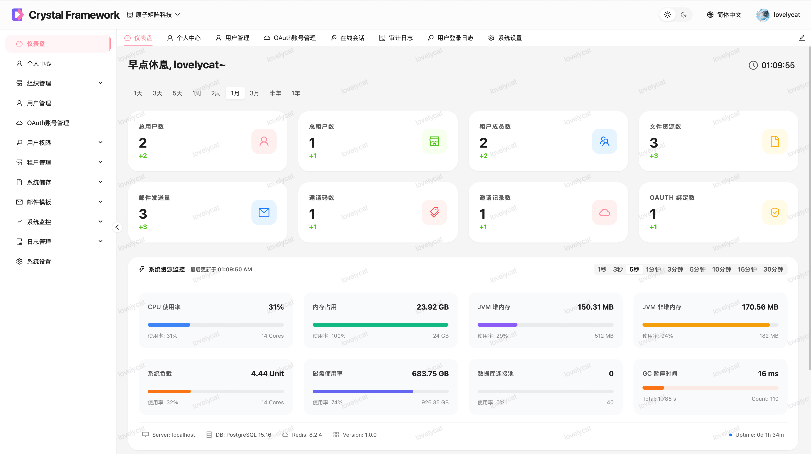
#### OAuth 账号管理
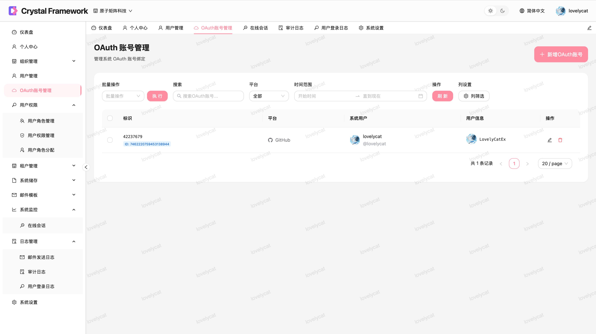
#### 用户权限管理
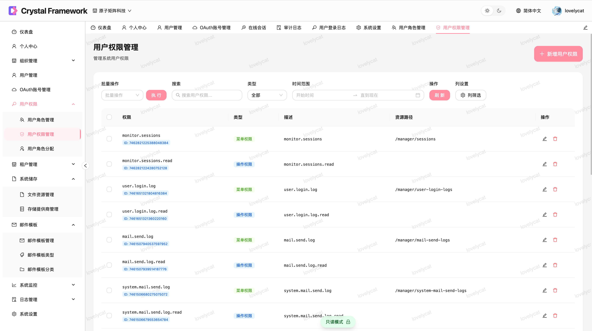
#### 存储供应商管理
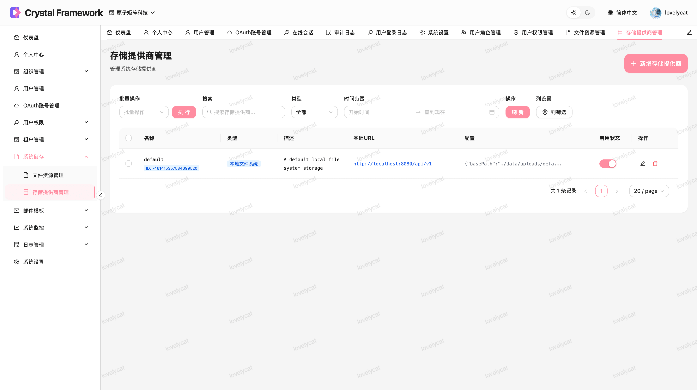
#### 文件资源管理
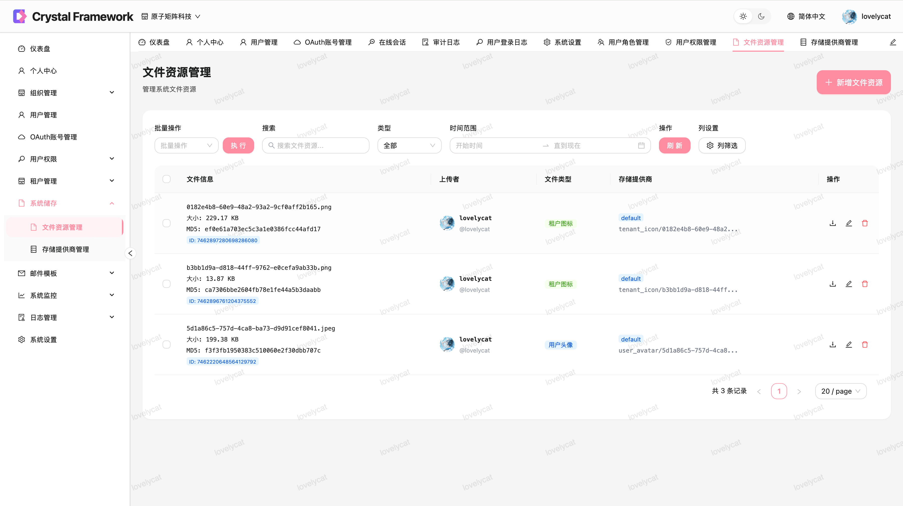
#### 邮件模板管理
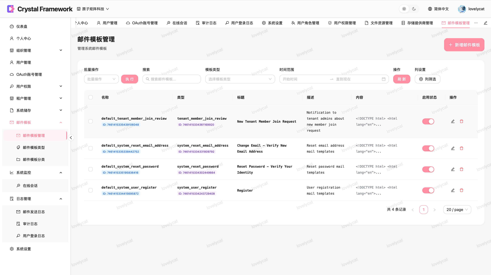
#### 审计日志
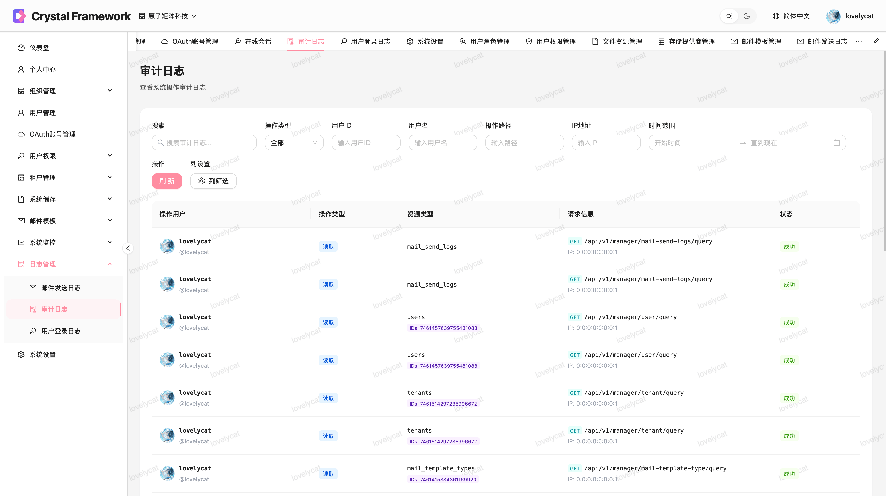
#### 租户管理
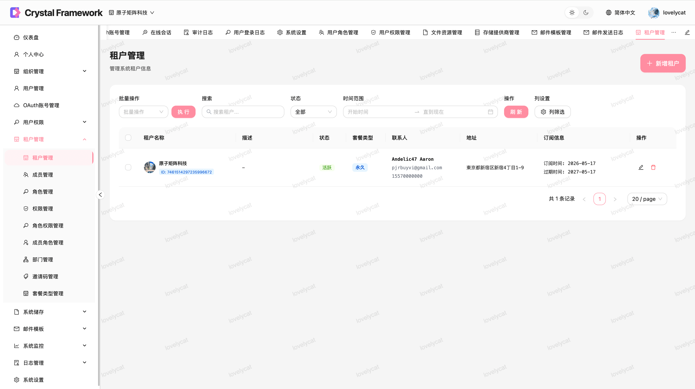
#### 租户成员管理
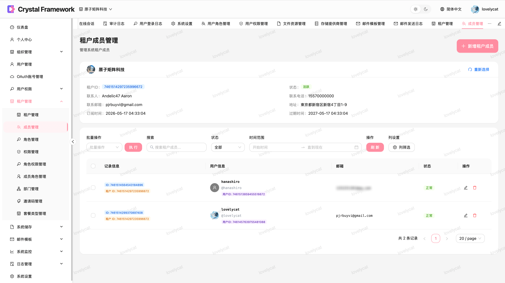
#### 租户部门管理
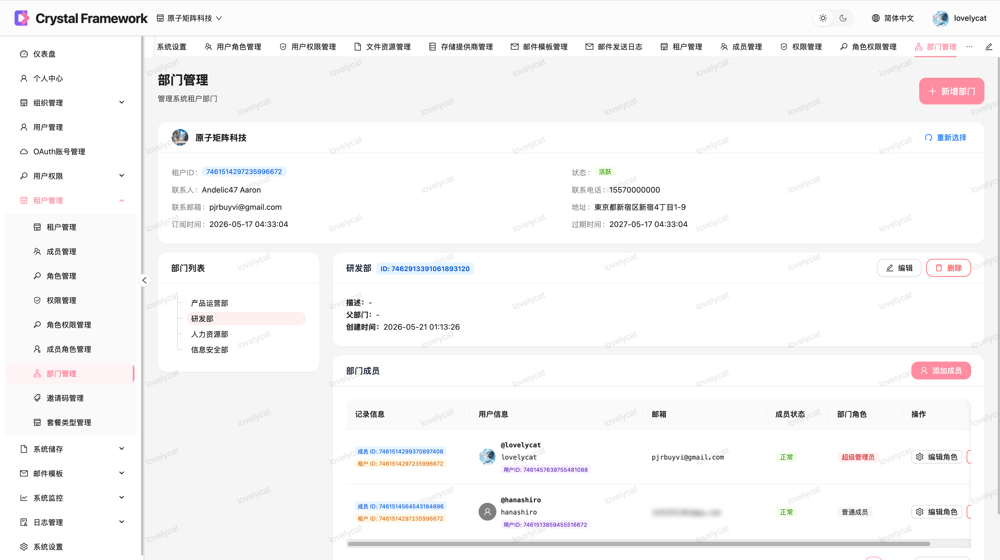
#### 租户邀请码管理
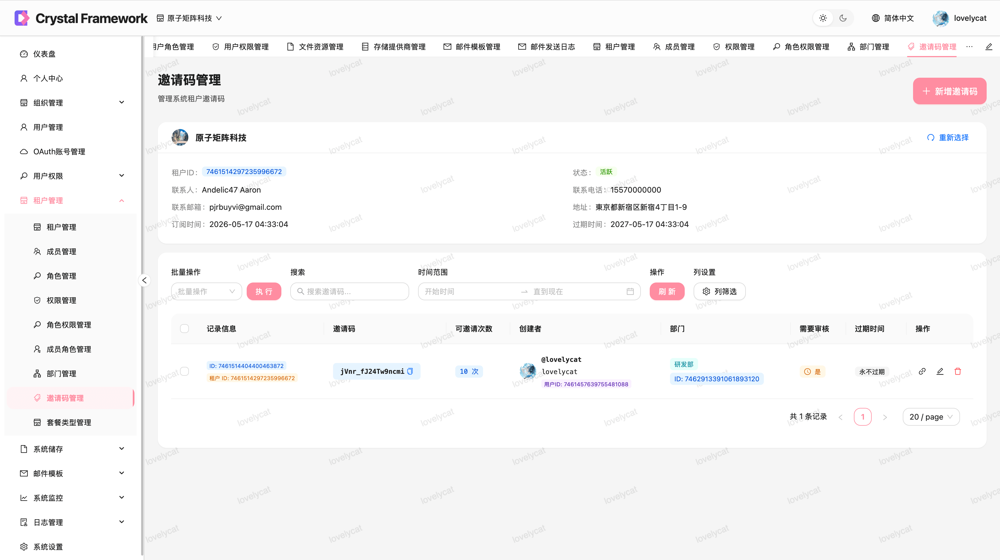
#### 系统设置-基本
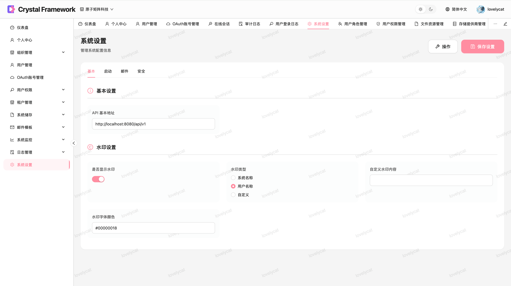
#### 系统设置-安全
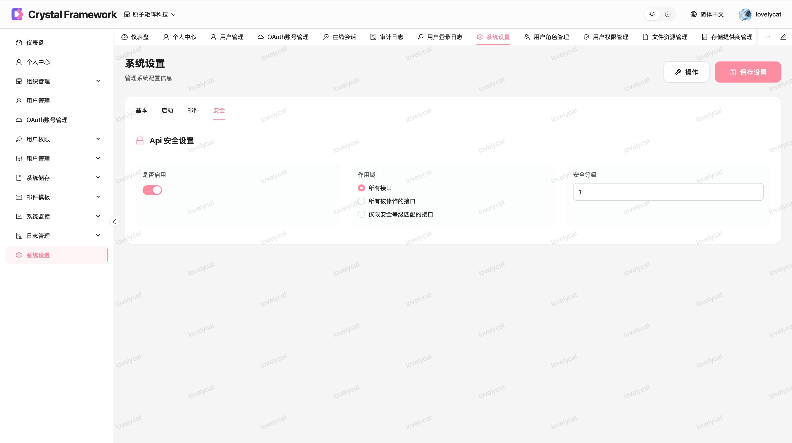
#### 系统设置-邮件
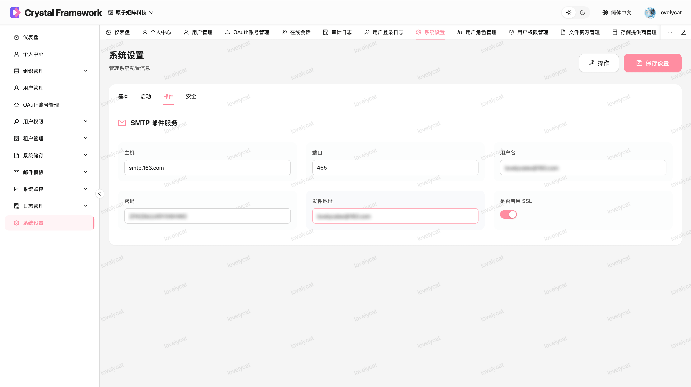

## 0x02 开发环境准备

本项目后端已支持使用 DevContainer 搭建开发环境，根据需要 Docker 或 DevContainer 二选一即可，不推荐自行搭建开发环境。

### 前置准备

#### VertexLib

**!!! 如果你打算使用 DevContainer 进行开发，此步骤已经集成，可以选择跳过。**

在开始之前，由于本项目依赖的 VertexLib 暂未发布到 maven 仓库，需要先构建该项目。

```bash
git clone https://github.com/LovelyCatEx/VertexLib.git
mvn install -DskipTests
```

注意一定要跳过测试，否则会构建失败。

#### 前端

本项目推荐使用 pnpm 包管理器，前端项目位于根目录下 `/web` 文件夹，使用下列命令初始化：

```bash
cd /web
pnpm install
```

常用命令：
1. 开发测试: `pnpm run dev`
2. 构建发版: `pnpm run build`

### DevContainer

DevContainer 是一种基于 Docker 容器的开发环境方案，由微软主导推动，旨在为开发者提供‌一致、隔离、可复现‌的开发环境。它通过将项目所需的所有依赖（如语言运行时、工具链、库、配置等）封装在容器中，实现开发环境无关的目标。

#### 操作步骤

1. DevContainer 的配置在项目根目录的 `.devcontainer` 文件夹中，可以使用 IDE 直接打开本项目并选择使用 DevContainer 开发。
2. 将项目根目录下的 `.env.example` 复制一份，改名为 `.env` 然后打开编辑。
3. 将 `.env` 文件中 `POSTGRES_HOST` 的值改为 `postgres`、`REDIS_HOST` 的值改成 `redis`、`SNAILJOB_SERVER_HOST` 的值改成 `snailjob`，保存。
4. 此时你可以直接启动后端项目，数据库将会自动初始化。

#### 挂载 Maven 仓库

DevContainer 容器默认使用的 Maven 仓库路径是 `.devcontainer/.m2/repository`，你可以将其改成本地已有的仓库，避免重复下载依赖。

一般情况下，Maven 默认的仓库路径是 `~/.m2/repository`，将 `./.m2/repository:/root/.m2/repository` 替换为 `~/.m2/repository:/root/.m2/repository` 即可。

### Docker

首先打开项目根目录下的 `.devcontainer` 文件夹，然后使用下面的命令启动项目开发所需的环境。

```bash
docker compose up --scale dev-server=0 -d
```

然后将项目根目录下的 `.env.example` 复制一份，改名为 `.env`。

到这里你可以直接启动后端项目，数据库将会自动初始化。

## 0x03 贡献说明

### 分支说明
1. master: 最新发布的版本在此分支
2. release: 预发布分支 ，由 develop 流转至此
3. develop: 开发分支，任何贡献必须 Fork 此分支进行开发

### 贡献规则

1. 首先从当前的 **develop** 分支 Fork 到你的仓库。
2. 在你的仓库对本项目进行修改。
3. 提出 Pull Request(PR) 到 **develop** 分支。
4. (非必须) PR 的标题请遵守如下命名规范: [Commit 信息编写规范](https://www.conventionalcommits.org/zh-hans/v1.0.0/)

## 0x04 开源协议

本项目使用 [MIT](https://opensource.org/licenses/MIT) 开源协议，感谢所有贡献者的支持和贡献！