<!-- markdownlint-disable -->

# CrystalFramework

 

    
    

    
    

    
    

<!-- markdownlint-restore -->

[简体中文](https://lovelycatex.github.io/crystal-framework/) | [English](https://lovelycatex.github.io/crystal-framework/en)

## 0x00 项目简介

CrystalFramework 是一个基于 Spring Boot 的现代化前后端开发框架，旨在为企业级应用提供稳定、高效、安全的基础设施。

**核心特性：**

- **AI 集成能力** - 统一的 AI Provider/Model 管理，支持多模型接入、用户组权限控制、调用记录追踪、AI Playground 交互式测试
- **认证授权体系** - 支持 OAuth2 登录（GitHub、Google、QQ）、JWT 令牌管理、WebSocket 认证限流
- **RBAC 权限控制** - 灵活的角色权限管理，支持系统级和租户级双层权限体系、细粒度资源访问控制
- **多租户架构** - 完善的租户隔离机制，支持租户成员/部门/角色管理、邀请码体系、租户级权益配置
- **审批流程引擎** - 可配置的审批流程管理，支持多级审批、条件分支、审批记录追溯
- **任务调度系统** - 分布式任务调度支持，定时任务管理、执行状态监控
- **智能缓存机制** - 基于 Redis 的实体缓存与 Session 管理，自动失效策略、缓存预热
- **邮件服务模块** - 邮件模板引擎、多类型邮件发送、发送日志追踪
- **资源管理模块** - 文件存储抽象层，支持阿里云 OSS、腾讯云 COS 等多种存储提供商
- **审计日志系统** - 完整的操作记录追踪，支持自定义审计注解、多维度查询分析
- **限流保护** - 通用限流服务，支持滑动窗口、指数退避策略、接口级流量控制
- **接口加密** - 基于 RSA+AES 混合加密，防护中间人攻击、请求签名验证
- **数据库分库分表** - 支持水平分库分表、两阶段提交、分布式事务协调
- **系统监控** - 实时性能监控、健康检查、关键指标采集
- **I18N 国际化** - 前后端 i18n 全覆盖，枚举翻译四步流程、语言文件热更新
- **容器化支持** - 提供 DevContainer 和 Docker Compose 配置，一键启动开发环境
- **SDK 封装** - 提供标准化 SDK，简化第三方集成接入

技术栈：Kotlin/Java、SpringBoot4、SpringSecurity、R2DBC、WebFlux、Postgres、Redis、Flyway、React、AntDesign、TailwindCSS、Docker

## 0x01 界面演示

### 后端界面

#### 仪表盘
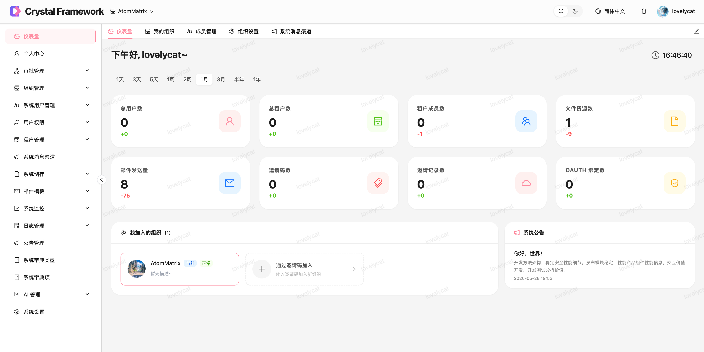
#### 审批流程-我的审批
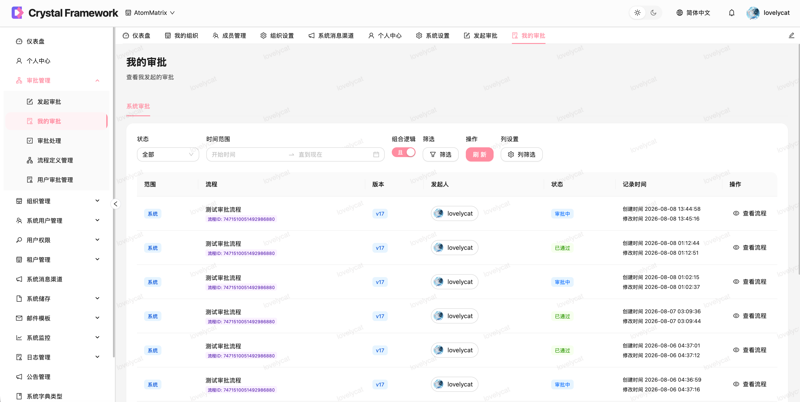
#### 审批流程-审批编辑
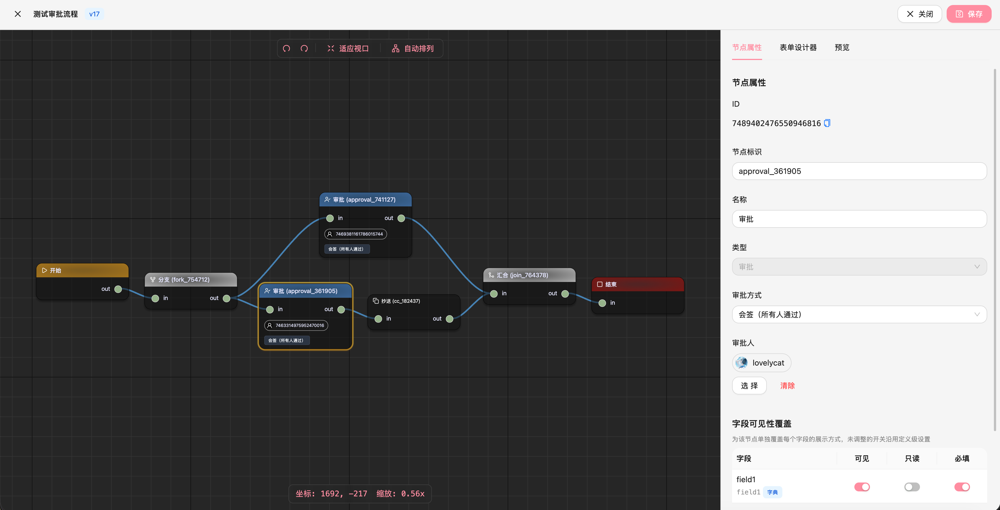
#### 组织信息
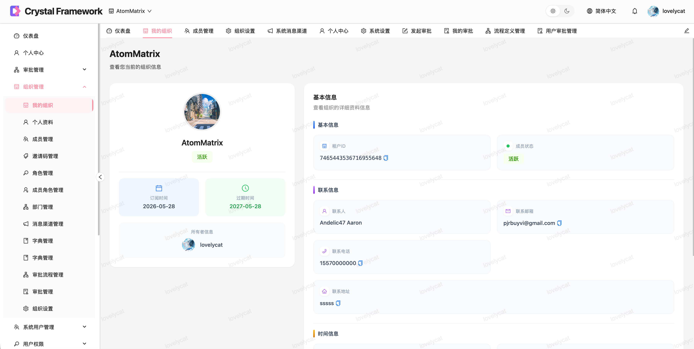
#### 组织成员管理
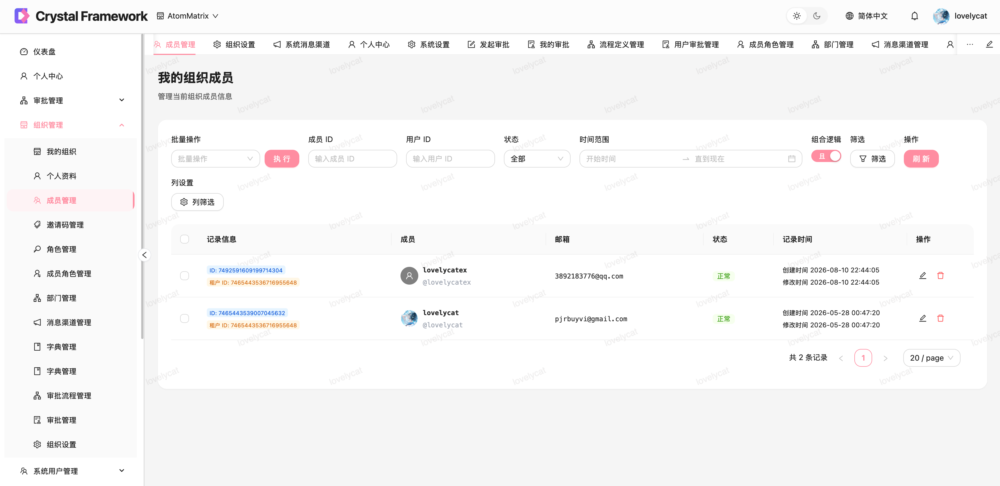
#### 组织部门管理
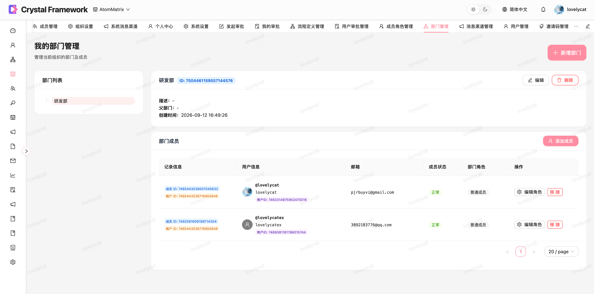
#### 租户邀请码管理
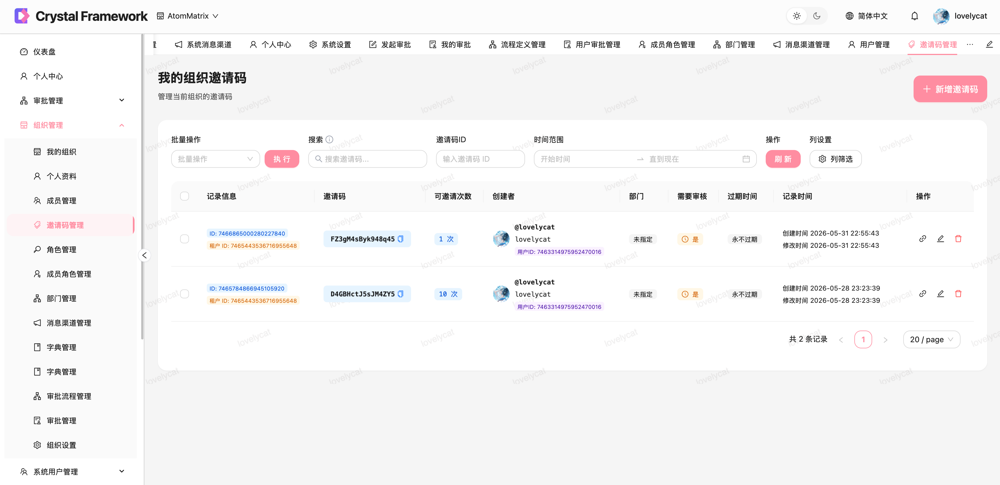
#### 系统用户管理
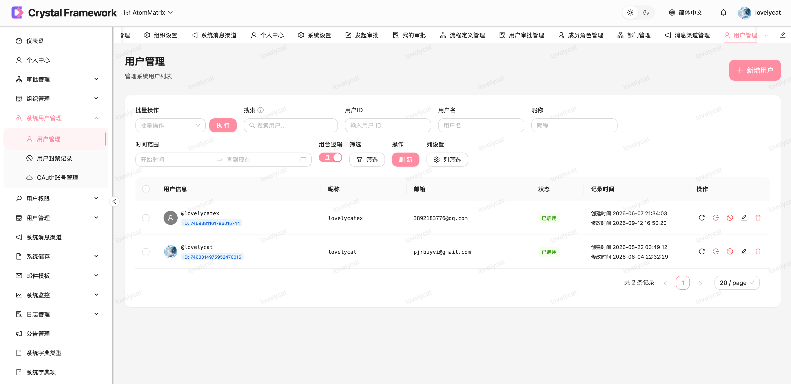
#### 用户权限管理
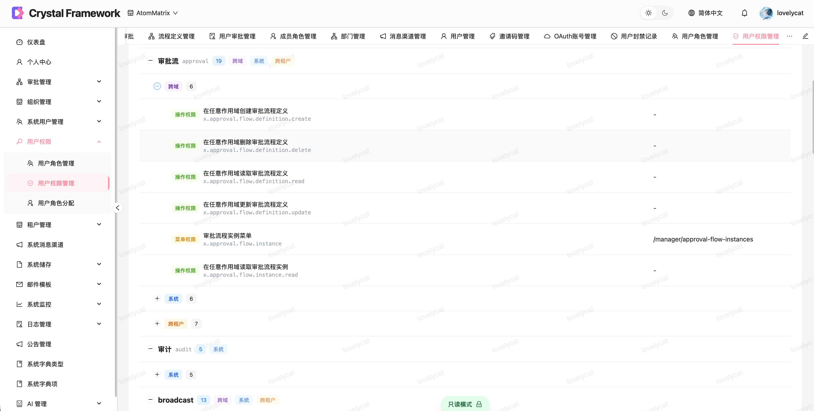
#### 文件资源管理
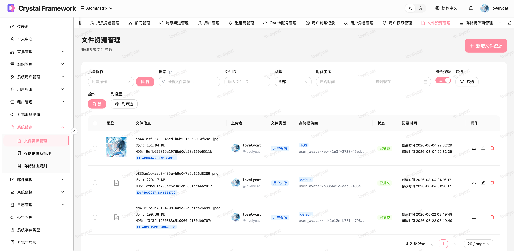
#### 邮件模板管理
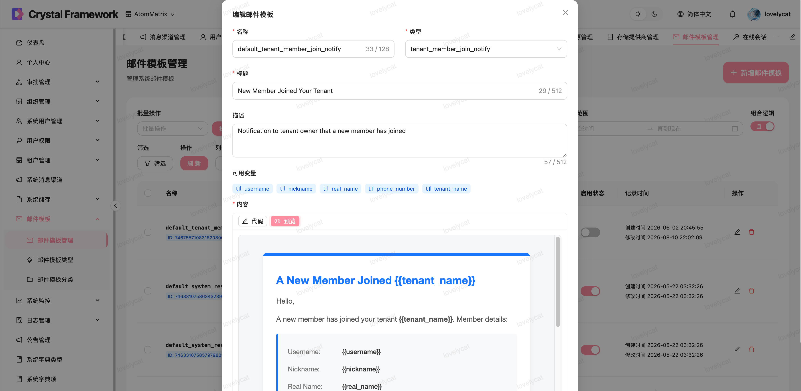
#### 系统监控
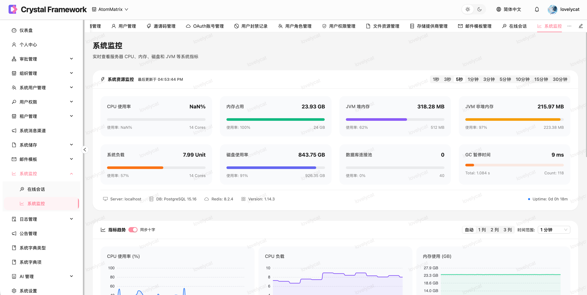
#### 审计日志
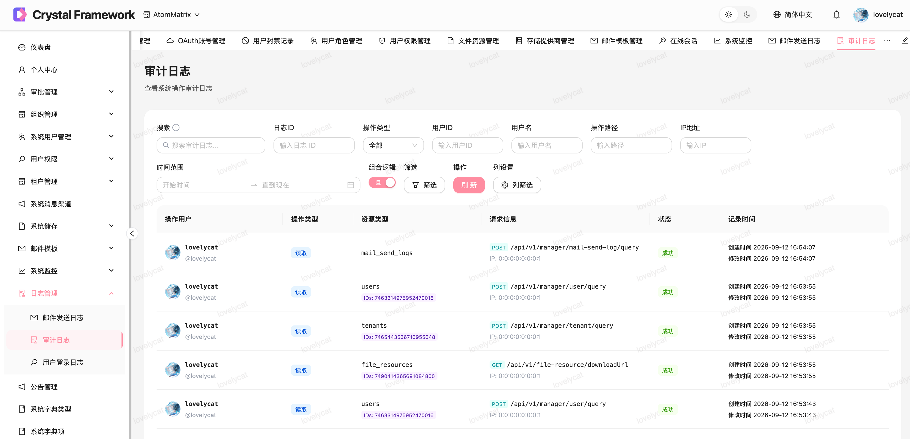
#### 系统设置-基本
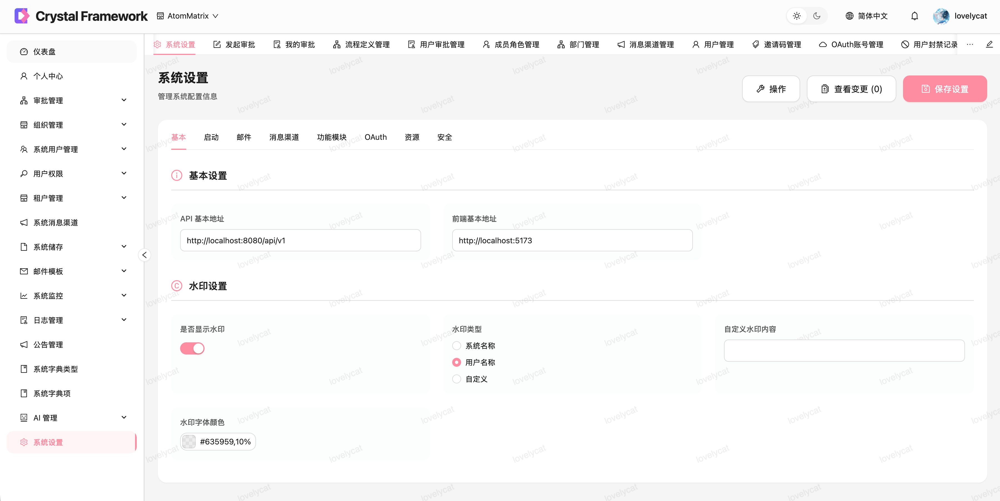
#### 系统设置-OAuth
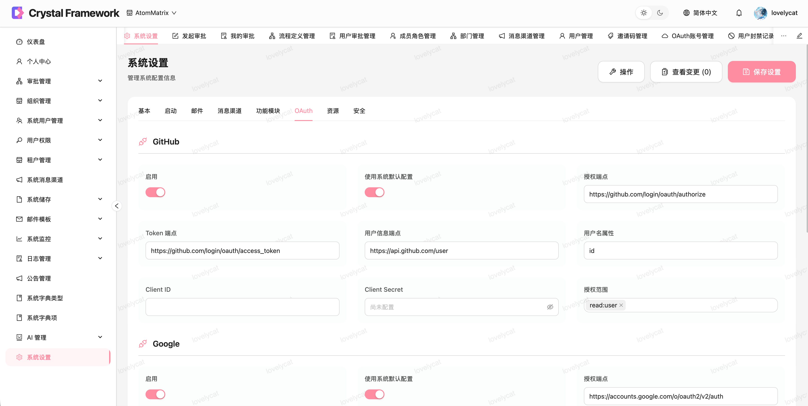
#### 系统设置-资源
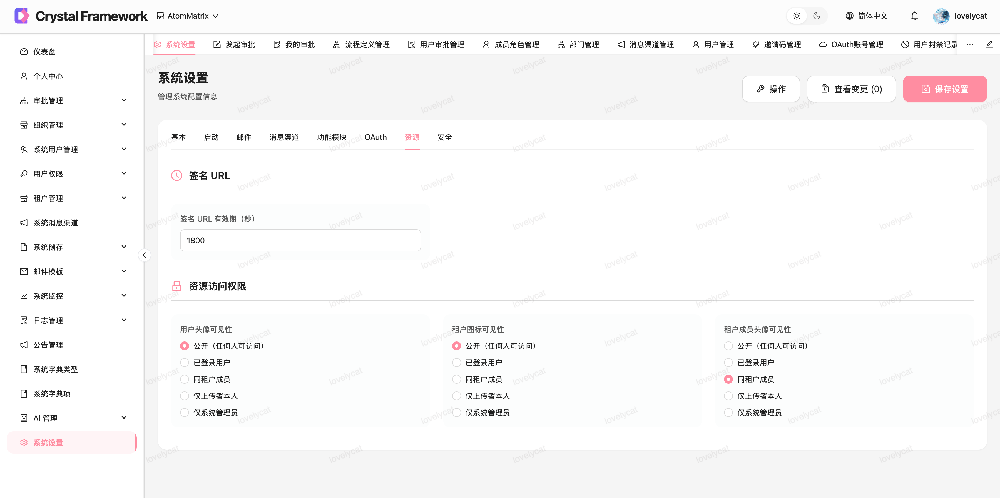
#### 系统设置-安全
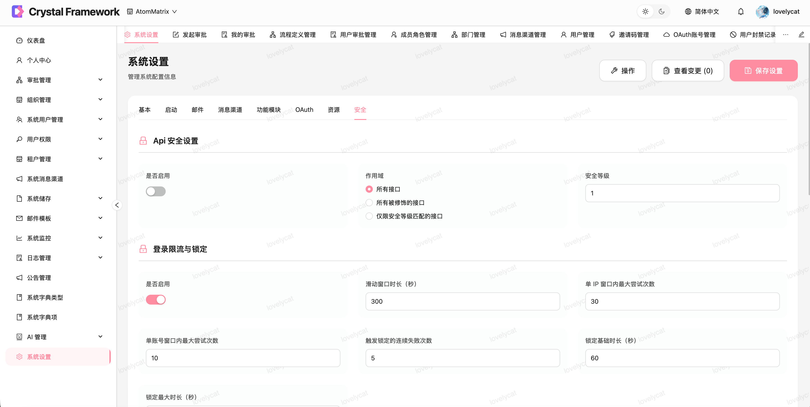
#### 系统设置-安全
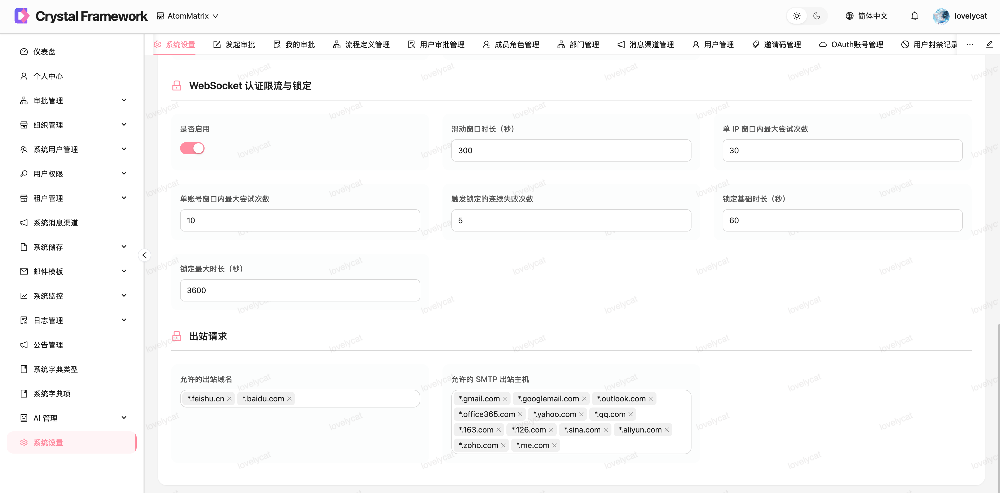
#### AI 管理-提供商
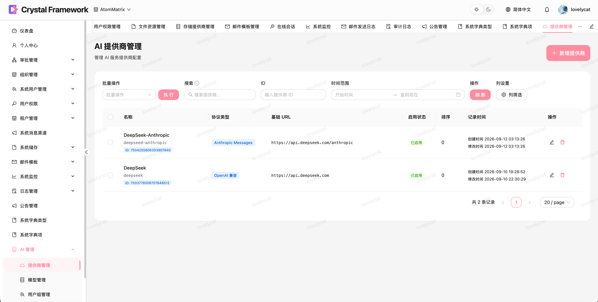
#### AI 管理-训练场
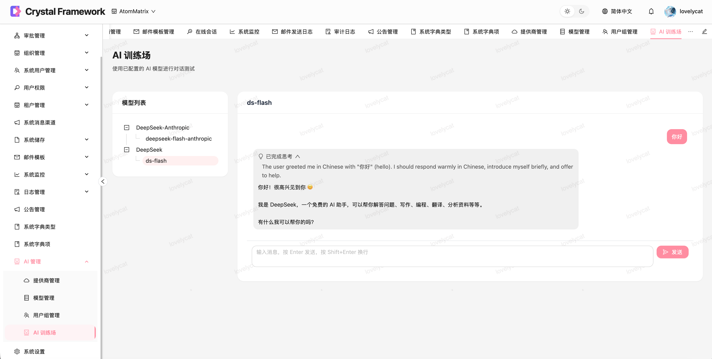

## 0x02 开发环境准备

请点击上方的语言名称进入对应的开发文档查看详细步骤。

## 0x03 贡献说明

### 分支说明
1. master: 最新发布的版本在此分支
2. release: 预发布分支 ，由 develop 流转至此
3. develop: 开发分支，任何贡献必须 Fork 此分支进行开发

### 贡献规则

1. 首先从当前的 **develop** 分支 Fork 到你的仓库。
2. 在你的仓库对本项目进行修改。
3. 提出 Pull Request(PR) 到 **develop** 分支。
4. (非必须) PR 的标题请遵守如下命名规范: [Commit 信息编写规范](https://www.conventionalcommits.org/zh-hans/v1.0.0/)

## 0x04 开源协议

本项目使用 [MIT](https://opensource.org/licenses/MIT) 开源协议，感谢所有贡献者的支持和贡献！